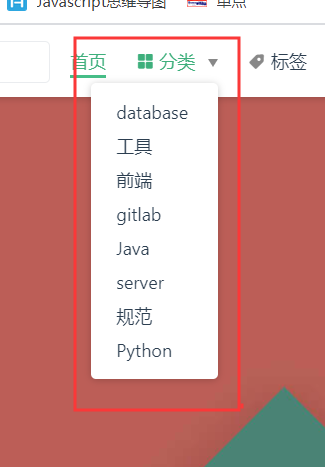

# 使用说明
## 环境
+ node版本大于10.x.x

## 启动
1. 安装依赖npm install或者cnpm install
2. `npm run docs:dev`启动好后访问[http://localhost:8080](http://localhost:8080)

## 写笔记
笔记记录在blogs目录下面，每一个目录对应一个分类

具体的分类配置在md文件中，如下：
```js
--- 
title: vue开发笔记
date: 2019-10-19
categories: 
 - 前端
tags: 
 - vue
 - axios
 - element-ui
 - 笔记
---
```
> title是题目，date是日期，categories就是分类，tags是标签
作者姓名在`.vuepress/config.js`中的`themeConfig.author`配置

## 部署
将改项目上传到自己的gitlab中每次提交就会自动部署生成gitpage

