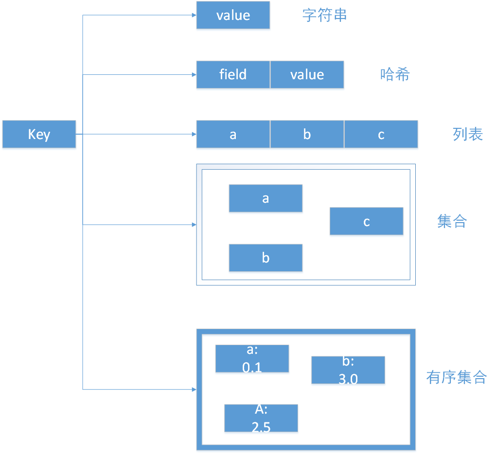
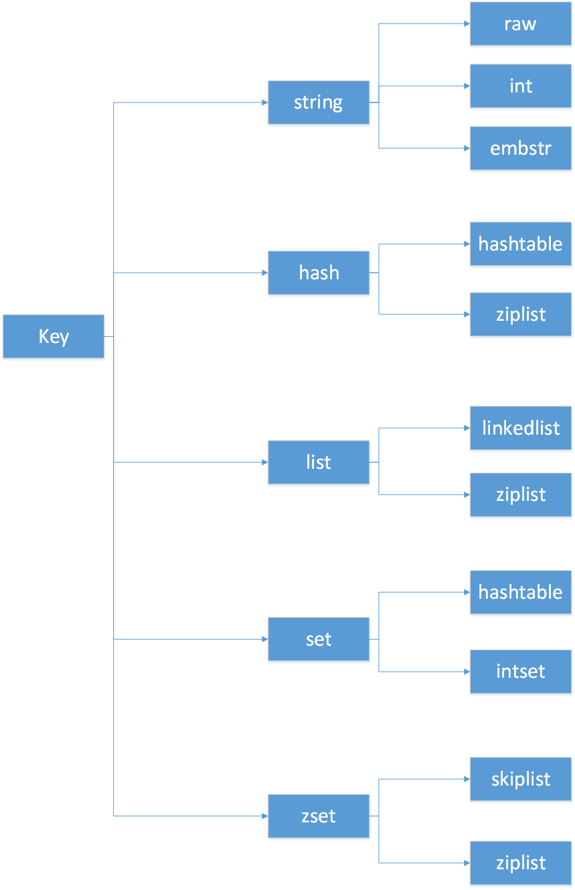
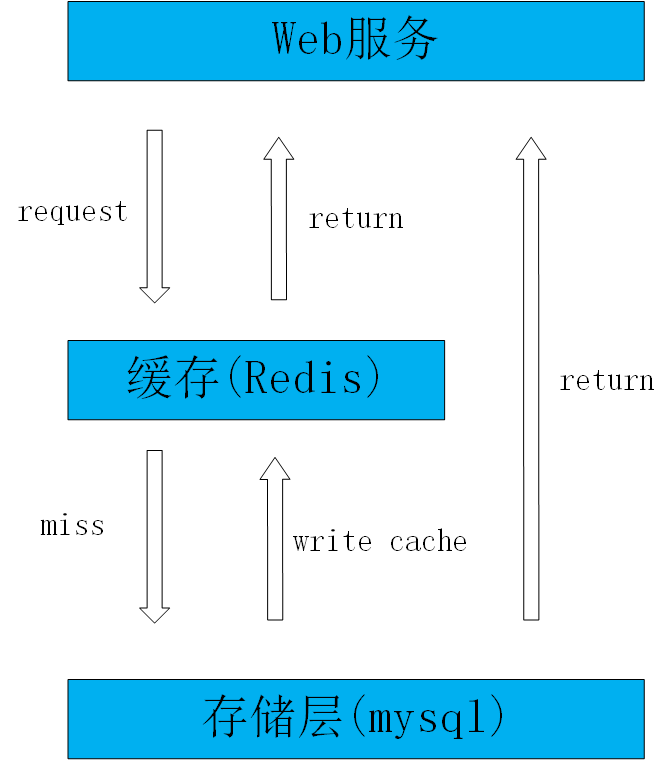
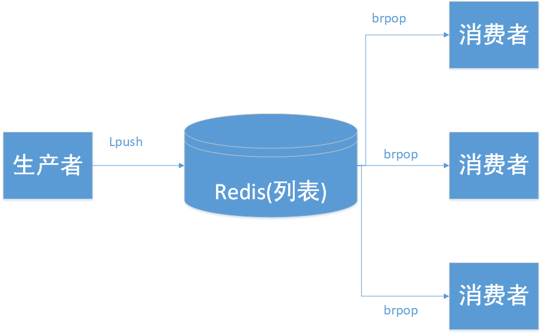
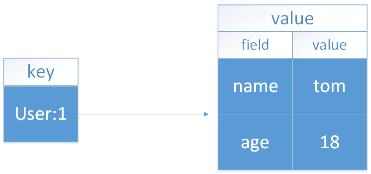

--- 
title: Redis基础
date: 2020-01-17
categories: 
 - 后端
tags: 
 - redis
---
::: tip 介绍
介绍Redis的基本概念以及对常用的API讲解，通过学习可以掌握对Redis基本的API的理解和使用
:::
<!-- more -->
## Redis介绍
###  简介

* Redis是用C语言开发的一个开源的高性能键值对（key-value）数据库。

### 特征

* 数据间没有必然的关联关系
* **内部采用单线程机制进行工作**
* **高性能**
* 多数据类型支持
  * 字符串类型 string
  * 列表类型 list
  * 散列类型 hash
  * 集合类型 set
  * 有序集合类型 sorted set
* 持久化支持  
### 数据结构和内部编码

#### 数据结构

`type`命令返回当前键的数据结构类型，分别是：

- 字符串
- 哈希
- 列表
- 集合
- 有序集合



​										 图1.1 redis数据结构

#### 内部编码

以上的数据结构只是redis对外的数据结构，实际上每种数据结构都有自己底层的内部编码实现，redis提供`object encoding`命令查询内部编码



​									图1.2 redis数据结构和内部编码
### Redis下载和安装

1. windows版本

   下载地址：< https://github.com/microsoftarchive/redis/releases/tag/win-3.2.100 >

2. 核心文件

   redis-server.exe  服务端可执行文件

   redis-cli  客户端可执行文件

   redis.conf  redis核心配置文件

   redis-check-aof.exe  AOF文件修复工具

   redis-check-dump.exe  RDB文件检查工具
### Redis基础命令
#### 1、常用基本命令

- keys pattern  遍历键

```
 * 代表匹配任意字符
 ? 代表匹配一个字符
 [] 代表匹配部分字符
 \x 用来做转义
```

- help cmd  获取一个具体指令的帮助信息
- dbsize   返回当前数据库中键的总数
- exists key   检查键是否存在，存在返回1，不存在返回0
- del key [key1 ...]  删除键，返回成功删除键的个数
- rename key newkey  键重命名
- randomkey  随机返回一个键
- expire key seconds  键过期，给键添加过期时间，超过过期时间后，会自动删除键

```
可以通过 ttl 命令观察键的的剩余过期时间，它有3种返回值
- 大于等于0：键剩余的过期时间
- -1：键没有设置过期时间
- -2：键不存在
```

- type key  查询键的数据结构类型
- object encoding key  查看内部编码

- select dbIndex  切换数据库（连接redis时，默认使用的是0号数据库）

#### 2、字符串（String）

##### 2.1 基本命令

- SET key value` 设置指定key的值
- `GET key` 获取指定key的值
- `GETRANGE key start end`  返回 key 中字符串值的子字符 （从0开始）
- `STRLEN key `  返回 key 所储存的字符串值的长度 
- `SETEX key seconds value`   将值 value 关联到 key ，并将 key 的过期时间设为 seconds (以秒为单位) 
- `SETNX key value`  只有在 key 不存在时设置 key 的值 
- `SETXX key value `  只有在key存在时才能设置成功，用于更新
- `SETRANGE key offset value` 用 value 参数覆写给定 key 所储存的字符串值，从偏移量 offset 开始 
- `MSET key value[key value]`  同时设置一个或多个 key-value 对 
- `MSETNX key value[key value]`  同时设置一个或多个 key-value 对，当且仅当所有给定 key 都不存在 
- `INCR key`  将 key 中储存的数字值增一 ,返回增加后的数值
- `INCRBY key increment`   将 key 所储存的值加上给定的增量值（increment） 
- `DECR key ` 将 key 中储存的数字值减一 
- `DECRBY key decrement ` key 所储存的值减去给定的减量值（decrement）  
- `APPEND key value ` 如果 key 已经存在并且是一个字符串， APPEND 命令将指定的 value 追加到该 key 原来值（value）的末尾 

##### 2.2 内部编码

1. int

   ```
   8个字节的长整型
   ```

2. embstr

   ```
   小于等于39个字节的字符串
   ```

3. raw

   ```
   大于39个字节的字符串
   ```

##### 2.3 应用场景

1. 缓存功能

   redis作为缓存层，关系型数据库（mysql）作为存储层，大部分请求的数据都是从redis中获取，若redis中不存在，再从mysql中读取并写入到redis中。由于redis具有支撑高并发的特性，所以缓存通常能起到加速读写和降低后端压力的作用。

   

   ​																		图2.1  缓存存储架构

   2. 共享session（企业级共享session方案-Spring session）
   3. 限速

#### 3、列表（List）

```
	列表类型是用来存储多个有序的字符串。列表类型有两个特点：
	1、列表中的元素是有序的，这就意味着可以通过索引下标的方式获取某个元素或者某个范围内的元素列表
	2、列表中的元素是可以重复的
```

##### 3.1 添加

- `LPUSH key value1[value2] `  将一个或多个值插入到列表头部 (头部插入)
- `LPUSHX key value `  将一个值插入到已存在的列表头部，列表不存在时操作无效 
- `RPUSH key value1[value2]`  在列表中添加一个或多个值 （尾部插入）
- `RPUSHX key value ` 用于将一个值插入到已存在的列表尾部(最右边)。如果列表不存在，操作无效
- `LINSERT key BEFORE|AFTER element value ` 将值 value 插入到列表 key 当中，位于值 element之前或之后（如果列表中存在重复的元素，则以从头部找到的第一个元素为准） 

##### 3.2 查询

- `LRANGE key strat stop `  获取列表指定范围内的元素 (LRANGE key 0 -1 获取所有)
- `LLEN key ` 获取列表长度 
- `LINDEX key index ` 通过索引获取列表中的元素 (索引从0开始)

##### 3.3 删除

- `LPOP key `  移出并获取列表的第一个元素 返回值为移除的元素
- `RPOP key ` 移除列表的最后一个元素，返回值为移除的元素
- ` LREM key count value ` 根据参数 count 的值，移除列表中与参数 value相等的元素 

```
- count > 0 : 从表头开始向表尾搜索，移除与 VALUE 相等的元素，数量为 COUNT 。
- count < 0 : 从表尾开始向表头搜索，移除与 VALUE 相等的元素，数量为 COUNT 的绝对值。
- count = 0 : 移除表中所有与 VALUE 相等的值。
```

- `LTRIM key start stop ` 对一个列表进行修剪(trim)，就是说，让列表只保留指定区间内的元素，不在指定区间之内的元素都将被删除 

- `RPOPLPUSH source destination ` 移除列表的最后一个元素，并将该元素添加到另一个列表并返回 
- `BRPOPLPUSH source destination timeout ` 从列表中弹出一个值，将弹出的元素插入到另外一个列表中并返回它； 如果列表没有元素会阻塞列表直到等待超时或发现可弹出元素为止

##### 3.4 修改

- `LSET key index value ` 通过索引设置列表元素的值

##### 3.5 阻塞

- `BLPOP key1[key2] timeout ` 移出并获取一个或多个列表的第一个元素， 如果列表没有元素会阻塞列表直到等待超时或发现可弹出元素为止 
- `BRPOP key1[key2] timeout `   移出并获取列表的最后一个元素， 如果列表没有元素会阻塞列表直到等待超时或发现可弹出元素为止

##### 3.6 内部编码

1. ziplist(压缩列表)

   当列标的元素个数小于list-max-ziplist-entries配置（默认512个），同时列表中的每个元素的值都小于list-max-ziplist-value配置（默认64个字节），redis选用ziplist来作为列表的内部实现。

2. linkedlist(链表)

   当列表类型无法满足ziplist的条件时，选用linkedlist作为列表的内部实现

##### 3.7 应用场景

1. 消息队列

   Redis的 lpush+brpop命令组合可以实现阻塞队列，生产者客户端使用lpush从列表左侧插入元素，多个消费者客户端使用brpop命令阻塞式的抢列表尾部的元素。

   

   ​																图3.1 Redis消息队列模型

   ```
   lpush+lpop=stack（栈）
   lpush+rpop=Queue（队列）
   lpush+brpop=Message Queue（消息队列）
   ```


#### 4、散列（Hash）

```
在Redis中，哈希类型是指键值本身又是一个键值对结构
```



​																		图4.1 哈希结构

##### 4.1 基本命令

- `hset key field value ` 设置值，设置成功返回1，否则返回0
- `hget key field ` 获取值，如果键或field不存在，会返回nil
- `hdel key field [field ...] ` 删除一个或多个field，返回结果为成功删除field的个数
- `hlen key `  计算field个数,，返回结果是field的个数
- `hmset key field value [field value ...]`  批量设置值
- `hmget key field [field ...]  批量获取值`
- `hexists key field ` 判断field是否存在
- `hkeys key `  获取所有field
- `hvals key `  获取所有value
- `hgetall key `  获取所有的field-value
- `hincrby key field increment `  对field的值自增指定数值
- `hincrbyfloat key field incrementfloat `  对field的值自增指定数值（可以是浮点数 ）

##### 4.2 内部编码

​	ziplist（压缩列表）：当哈希类型元素个数小于hash-max-ziplist-entries配置（默认512个）、同时所有值都小于hash-max-ziplist-value配置（默认64字节）时，redis会使用ziplist作为哈希的内部实现，ziplist使用更加紧凑的结构实现多个元素的连续存储，所以在节省内存方面比hashtable更优秀。

​	hashtable（哈希表）：当哈希类型无法那边只有ziplist的条件时，redis使用hashtable作为哈希的内部实现。

#### 5、集合（Set）

```
集合类型也是用来保存多个的字符串元素，但和列表类型不一样的是，集合中不允许有重复元素，并且集合中的元素是无序的，不能通过索引下标获取元素。
```

##### 5.1 基本命令

###### 5.1.1 集合内操作

- `sadd key element [element ...] `  添加元素，返回结果为添加成功的元素个数
- `srem key element [element ...] `  删除元素，返回结果为删除成功的元素个数
- `scard key `  计算元素个数
- `sismember key element `  判断元素是否在集合中，在集合内返回1，否则返回0
- `srandmember key [count] `  随机从集合中返回指定个数元素，count是参数，如果不写默认为1
- `spop key `  从集合中随机弹出一个元素

```
srandmember 和 spop的不同：
	spop命令执行后，元素会从集合中删除，而srandmember不会
```

- `smembers key `   获取所有元素，返回结果是无序的

###### 5.1.2 集合间操作

1. 求交集

   ```
   取两个集合相同的部分。若只有一个集合，则返回集合本身
   ```

   - sinter key [key ...]

2. 求并集

   ```
   合并两个集合的所有元素，相同的进行去重。若只有一个集合，则返回集合本身
   ```

   - sunion key [key ...]

3. 求差集

   ```
   返回在第一个集合中存在，且不在第二个集合中存在的元素。若只有一个集合，则返回集合本身
   ```

   - sdiff key [key ...]

4. 将交集、并集、差集的结果保存

   - sinterstore destination key [key ...]
   - sunionstore destination key [key ...]
   - sdiffstore destination key [key ...]

##### 5.2 内部编码

1. intset（整数集合）

   当集合中的元素都是整数且元素个数小于set-max-intset-entries配置（默认512个），redis会选用intset来作为集合的内部实现，从而减少内存的使用

2. hashtable（哈希表）

   当集合类型无法满足intset的条件时，redis会选用hashtable作为集合的内部实

#### 6、有序集合

```
有序集合保留了集合不能有重复成员的特性，但不同的是，有序集合中的元素可以排序。但是它和列表使用索引下标作为排序依据不同的是，它给每个元素设置一个分数作为排序的依据。
```

##### 6.1 基本命令

- `zadd key score member [score member ...]`    添加成员
- `zcard key `  计算成员个数
- `zscore key member `   计算某个成员的分数
- `zrank key member `   计算成员的排名，从分数从低到高返回排名，排名从0开始计算
- `zrevrank key member `   计算成员的排名，从分数从高到低返回排名，排名从0开始计算 
- `zrem key member[member...]  删除成员`
- `zincrby key increment member `  增加成员的分数
- `zrange key start end [withscores] `  返回指定排名范围的成员，如果加上withscores选项，会同时返回成员的分数

```
zrange 是从低到高返回（升序），zrevrange 是从高到低返回（降序）
```

- `zrangebyscore key min max [withscores] `  返回指定分数范围的成员，如果加上withscores选项，会同时返回成员的分数

```
1、zrangebyscore 是从低到高返回（升序），zrevrangebyscore 是从高到低返回（降序）
2、min和max还支持开区间（小括号）和闭区间（中括号）
3、-inf和+inf分别代表负无穷和正无穷
```

- `zcount key min max  `   返回指定分数范围成员个数
- `zremrangebyrank key start end `  删除指定排名内的升序元素
- `zremrangebyscore key min max `  删除指定分数范围的成员

##### 6.2 内部编码

1. ziplist（压缩列表）

   当有序集合的元素个数小于zset-max-ziplist-entries配置（默认128个），同时每个元素的值都小于zset-max-ziplist-value配置（默认64字节），使用ziplist来作为有序集合的内部实现

2. skiplist（跳跃表）

   ziplist条件不满足时，有序集合使用skiplist作为内部实现

<!--
### 集群
### 高可用解决方案-哨兵
### 缓存穿透
### 缓存击穿
### 缓存雪崩
-->


