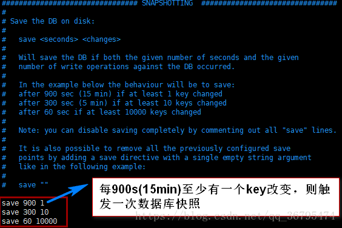
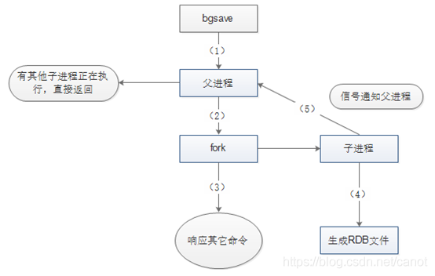
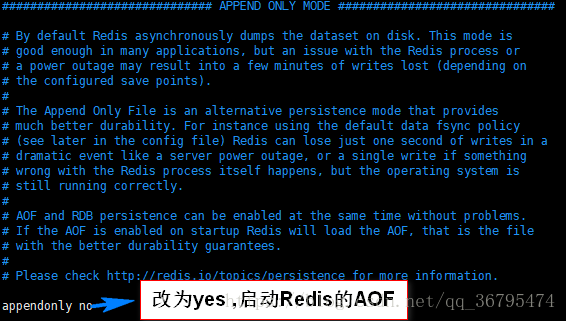
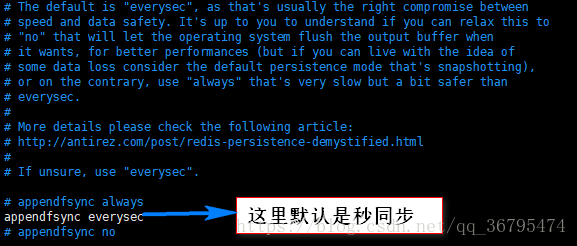

--- 
title: Redis持久化之RDB和AOF
date: 2020-09-01
categories: 
 - 后端
tags: 
 - redis
---
::: tip 介绍
介绍Redis的两种持久化方式（RDB和AOF）,以及一些常见的配置
:::

<!-- more -->
## Redis持久化存储模式之RDB（Redis DataBase）
### RDB概述
> RDB是指在指定时间间隔内，将内存中的数据集快照写入磁盘，也就是Snapshot快照，它恢复时是将快照文件直接读到内存中，来达到恢复数据的。
### 持久化机制
> Redis会单独创建(fork)一个子进程来进行持久化，会先将数据写进一个临时文件中，等到持久化过程结束了，再用这个临时文件替换上次持久化好的文件。在这个过程中，只有子进程来负责IO操作，主进程仍然处理客户端的请求，这就确保了极高的性能。
### 快照（Snapshot）
> 在默认情况下， Redis 将数据库快照保存在名字为 dump.rdb 的二进制文件中。通过触发快照的形式，来做到将指定时间间隔内的数据持久化到dump.rdb。例如，可以2分钟内持久化一次，将对数据库的写操作，备份到磁盘上的dump.rdb。如何触发持久化呢？可以通过查看或者设置redis.conf配置文件来指定触发规则。

以下是redis配置文件的触发快照的默认配置<br>
<br>
配置文件中还有一些基础的配置项，如下：<br>
```javascript
#dbfilename：持久化数据存储在本地的文件
dbfilename dump.rdb
#dir：持久化数据存储在本地的路径，如果是在/redis/redis-3.0.6/src下启动的redis-cli，则数据会存储在当前src目录下
dir ./
##snapshot触发的时机，save <seconds> <changes>  
##如下为900秒后，至少有一个变更操作，才会snapshot  
##对于此值的设置，需要谨慎，评估系统的变更操作密集程度  
##可以通过“save “””来关闭snapshot功能  
#save时间，以下分别表示更改了1个key时间隔900s进行持久化存储；更改了10个key300s进行存储；更改10000个key60s进行存储。
save 900 1
save 300 10
save 60 10000
##当snapshot时出现错误无法继续时，是否阻塞客户端“变更操作”，“错误”可能因为磁盘已满/磁盘故障/OS级别异常等  
stop-writes-on-bgsave-error yes  
##是否启用rdb文件压缩，默认为“yes”，压缩往往意味着“额外的cpu消耗”，同时也意味这较小的文件尺寸以及较短的网络传输时间  
rdbcompression yes  
```
snapshot触发的时机，是有“间隔时间”和“变更次数”共同决定，同时符合2个条件才会触发snapshot,否则“变更次数”会被继续累加到下一个“间隔时间”上。snapshot过程中并不阻塞客户端请求。snapshot首先将数据写入临时文件，当成功结束后，将临时文件重名为dump.rdb。
需要注意的是，每次快照持久化都是将内存数据完整写入到磁盘一次，并不是增量的只同步脏数据。如果数据量大的话，而且写操作比较多，必然会引起大量的磁盘io操作，可能会严重影响性能。
<br>
其他自动触发机制:<br>
除了save m n 以外和手动调用命令外，还有一些其他情况会触发bgsave：
> 1. 在主从复制场景下，如果从节点执行全量复制操作，则主节点会执行bgsave命令，并将rdb文件发送给从节点
> 2. 执行shutdown命令时，自动执行rdb持久化

### save m n 实现原理
Redis的save m n，是通过serverCron函数、dirty计数器、和lastsave时间戳来实现的。

serverCron是Redis服务器的周期性操作函数，默认每隔100ms执行一次；该函数对服务器的状态进行维护，其中一项工作就是检查 save m n 配置的条件是否满足，如果满足就执行bgsave。

dirty计数器是Redis服务器维持的一个状态，记录了上一次执行bgsave/save命令后，服务器状态进行了多少次修改(包括增删改)；而当save/bgsave执行完成后，会将dirty重新置为0。

例如，如果Redis执行了set mykey helloworld，则dirty值会+1；如果执行了sadd myset v1 v2 v3，则dirty值会+3；注意dirty记录的是服务器进行了多少次修改，而不是客户端执行了多少修改数据的命令。

lastsave时间戳也是Redis服务器维持的一个状态，记录的是上一次成功执行save/bgsave的时间。

save m n的原理如下：每隔100ms，执行serverCron函数；在serverCron函数中，遍历save m n配置的保存条件，只要有一个条件满足，就进行bgsave。对于每一个save m n条件，只有下面两条同时满足时才算满足：
> 1. 当前时间-lastsave > m
> 2. dirty >= n

### Snapshot执行流程

```javascript
1. Redis父进程首先判断：当前是否在执行save，或bgsave/bgrewriteaof（后面会详细介绍该命令）的子进程，如果在执行则bgsave命令直接返回。bgsave/bgrewriteaof 的子进程不能同时执行，主要是基于性能方面的考虑：两个并发的子进程同时执行大量的磁盘写操作，可能引起严重的性能问题。
2. 父进程执行fork操作创建子进程，这个过程中父进程是阻塞的，Redis不能执行来自客户端的任何命令
3. 父进程fork后，bgsave命令返回”Background saving started”信息并不再阻塞父进程，并可以响应其他命令
4. 子进程创建RDB文件，根据父进程内存快照生成临时快照文件，完成后对原有文件进行原子替换
5. 子进程发送信号给父进程表示完成，父进程更新统计信息
```
### RDB总结
#### RDB优点
```javascript
1. 如果要进行大规模数据的恢复，RDB方式要比AOF方式恢复速度要快。
2. RDB可以最大化Redis性能，父进程做的就是fork子进程，然后继续接受客户端请求，让子进程负责持久化操作，父进程无需进行IO操作。
3. RDB是一个非常紧凑(compact)的文件,它保存了某个时间点的数据集，非常适合用作备份，同时也非常适合用作灾难性恢复，它只有一个文件，内容紧凑，通过备份原文件到本机外的其他主机上，一旦本机发生宕机，就能将备份文件复制到redis安装目录下，通过启用服务就能完成数据的恢复。
```
#### RDB缺点
```javascript
1. RDB这种持久化方式不太适应对数据完整性要求严格的情况，因为，尽管我们可以用过修改快照实现持久化的频率，但是要持久化的数据是一段时间内的整个数据集的状态，如果在还没有触发快照时，本机就宕机了，那么对数据库所做的写操作就随之而消失了并没有持久化本地dump.rdb文件中。
2. 每次进行RDB时，父进程都会fork一个子进程，由子进程来进行实际的持久化操作，如果数据集庞大，那么fork出子进程的这个过程将是非常耗时的，就会出现服务器暂停客户端请求，将内存中的数据复制一份给子进程，让子进程进行持久化操作。
```
## Redis持久化存储模式之AOF（Append Only  File）
### AOF概述
> 以日志的形式记录Redis每一个写操作,将Redis执行过的所有写指令记录下来（读操作不记录），只许追加文件不可以改写文件，redis启动之后会读取appendonly.aof文件来实现重新恢复数据，完成恢复数据的工作。默认不开启，需要将redis.conf中的appendonly  no改为yes启动Redis。





```javascript
1. always：每一条aof记录都立即同步到文件，这是最安全的方式，也以为更多的磁盘操作和阻塞延迟，是IO开支较大。
2. everysec：每秒同步一次，性能和安全都比较中庸的方式，也是redis推荐的方式。如果遇到物理服务器故障，有可能导致最近一秒内aof记录丢失(可能为部分丢失)。
3. no：redis并不直接调用文件同步，而是交给操作系统来处理，操作系统可以根据buffer填充情况/通道空闲时间等择机触发同步；这是一种普通的文件操作方式。性能较好，在物理服务器故障时，数据丢失量会因OS配置有关。
```
一些常用的配置：

```javascript
##此选项为aof功能的开关，默认为“no”，可以通过“yes”来开启aof功能  
##只有在“yes”下，aof重写/文件同步等特性才会生效  
appendonly yes  
  
##指定aof文件名称  
appendfilename appendonly.aof  
  
##指定aof操作中文件同步策略，有三个合法值：always everysec no,默认为everysec  
appendfsync everysec  
##在aof-rewrite期间，appendfsync是否暂缓文件同步，"no"表示“不暂缓”，“yes”表示“暂缓”，默认为“no”  
no-appendfsync-on-rewrite no  
  
##aof文件rewrite触发的最小文件尺寸(mb,gb),只有大于此aof文件大于此尺寸是才会触发rewrite，默认“64mb”，建议“512mb”  
auto-aof-rewrite-min-size 64mb  
  
##相对于“上一次”rewrite，本次rewrite触发时aof文件应该增长的百分比。  
##每一次rewrite之后，redis都会记录下此时“新aof”文件的大小(例如A)，那么当aof文件增长到A*(1 + p)之后  
##触发下一次rewrite，每一次aof记录的添加，都会检测当前aof文件的尺寸。  
auto-aof-rewrite-percentage 100  
```

### 数据恢复
> 重启Redis时，如果dump.rdb与appendfsync.aof同时都存在时，Redis会自动读取appendfsync.aof文件，通过该文件中对数据库的日志操作，来实现数据的恢复。当然如果该文件被破坏，我们可以通过redis-check-aof工具来修复，如redis-check-aof --fix能修复破损的appendfsync.aof文件，当然如果dump.rdb文件有破损，我们也可以用redis-check-rdb工具来修复，如果appendfsync.aof文件破损了，是启动不客户端的，也就是无法完成数据的恢复。

### 重写
> 重写原理：AOF文件持续增长过大时，会fork出一条新进程来将文件重写（也是临时文件最后再rename）,遍历新进程的内存中的数据，每条记录都会有一条set语句，重写aof文件的操作，并没有读取旧的aof文件，而是将整个内存中的数据库内容用命令的方式重写了一个新的aof文件，有点类似于快照。

> 触发机制：Redis会记录上一次重写时的AOF大小，默认配置是当AOF文件大小是上一次的一倍并且大于64m时，会触发从写机制。

### AOF总结
#### AOF有点
```javascript
1. AOF有着多种持久化策略：
  appendfsync always:每修改同步，每一次发生数据变更都会持久化到磁盘上，性能较差，但数据完整性较好。

  appendfsync everysec: 每秒同步，每秒内记录操作，异步操作，如果一秒内宕机，有数据丢失。

  appendfsync no:不同步。

2. AOF文件是一个只进行追加操作的日志文件，对文件写入不需要进行seek，即使在追加的过程中，写入了不完整的命令（例如：磁盘已满），可以使用redis-check-aof工具可以修复这种问题

3. Redis可以在AOF文件变得过大时，会自动地在后台对AOF进行重写：重写后的新的AOF文件包含了恢复当前数据集所需的最小命令集合。整个重写操作是绝对安全的，因为Redis在创建AOF文件的过程中，会继续将命令追加到现有的AOF文件中，即使在重写的过程中发生宕机，现有的AOF文件也不会丢失。一旦新AOF文件创建完毕，Redis就会从旧的AOF文件切换到新的AOF文件，并对新的AOF文件进行追加操作。

4. AOF文件有序地保存了对数据库执行的所有写入操作。这些写入操作一Redis协议的格式保存，易于对文件进行分析；例如，如果不小心执行了FLUSHALL命令，但只要AOF文件未被重写，通过停止服务器，移除AOF文件末尾的FLUSHALL命令，重启服务器就能达到FLUSHALL执行之前的状态。
```

#### AOF缺点
```javascript
1. 对于相同的数据集来说，AOF文件要比RDB文件大。
2. 根据所使用的持久化策略来说，AOF的速度要慢与RDB。一般情况下，每秒同步策略效果较好。不使用同步策略的情况下，AOF与RDB速度一样快。
```

*参考链接：* 
- [Redis持久化存储(AOF与RDB两种模式)](https://blog.csdn.net/canot/article/details/52886923) 
- [Redis的两种持久化RDB和AOF](https://blog.csdn.net/qq_36795474/article/details/82938721?utm_medium=distribute.pc_relevant.none-task-blog-BlogCommendFromMachineLearnPai2-1.channel_param&depth_1-utm_source=distribute.pc_relevant.none-task-blog-BlogCommendFromMachineLearnPai2-1.channel_param)
