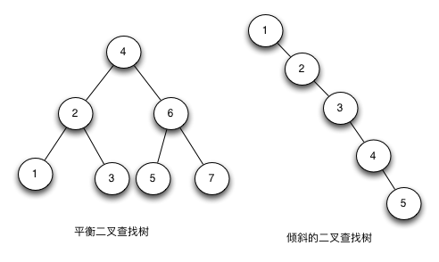

--- 
title: 二叉树与红黑树
date: 2020-07-08
categories: 
 - 数据结构
tags: 
 - 数据结构
---

## 二叉树与红黑树

### 二叉树(BST binary search/sort tree)
> 二叉查找树就是一颗二叉树，它的左节点比父节点小，右节点比父节点大。它的高度决定了查找效率

理想状态下，二叉树的增删改查的时间复杂度为O(LogN)，最坏的情况为O(N)。 
当他的高度为LogN+1时，我们说二叉查找树是平衡的。

**BST存在的问题** 

    树的高度直接决定了树的查找效率。
    理想的高度是 h = logN，最坏的情况是所有的节点都在一条斜线上，这样树的高度就为N

> [演示地址](https://www.cs.usfca.edu/~galles/visualization/BST.html)

### 红黑树(RBTree Red-Black Tree)
> 红黑树又称平衡查找二叉树。平衡树的插入和删除的时候，会通过旋转操作将高度保持在LogN。

> [参考链接](https://www.jianshu.com/p/e136ec79235c)

> [演示地址](https://www.cs.usfca.edu/~galles/visualization/RedBlack.html)

