--- 
title: vue-cli搭建前端vue项目
date: 2021-1-13
categories: 
 - 前端
tags: 
 - vue
---

# 前端项目框架搭建指南
## 环境准备
1. [安装node](node_install.html)
2. [安装Webstorm及配置](webstorm_intall.html)

### 安装vuecli
有任何不清楚的可查看[官方文档](https://cli.vuejs.org/zh/guide/)
1. npm install -g @vue/cli-service-global，写此文档时最新版本为`4.3.1`
2. cmd中验证vuecli是否安装成功`vue --version`
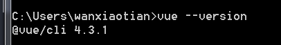

## 框架搭建
### 使用vuecli构建项目
1. cmd中运行vue ui，然后用浏览器访问起好的服务，一般是`http://localhost:8000`
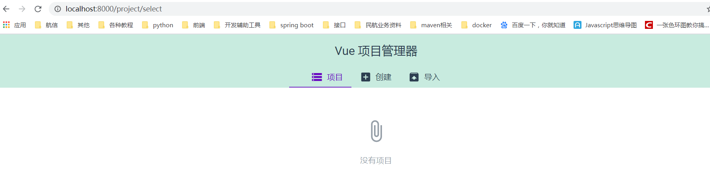
2. 开始构建项目
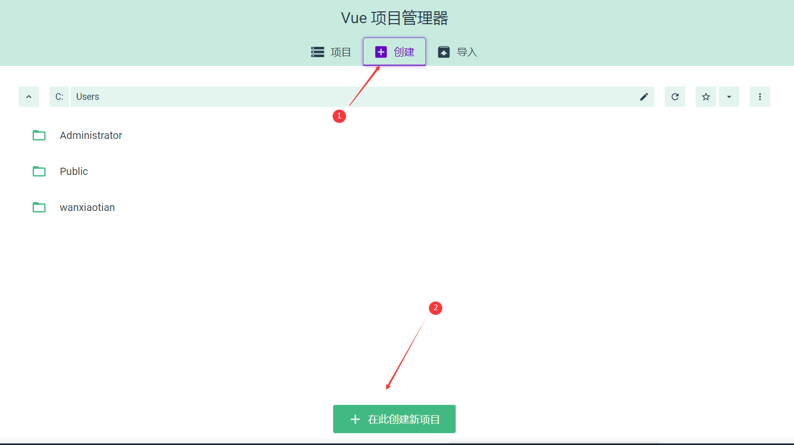
3. 按照提示构建项目
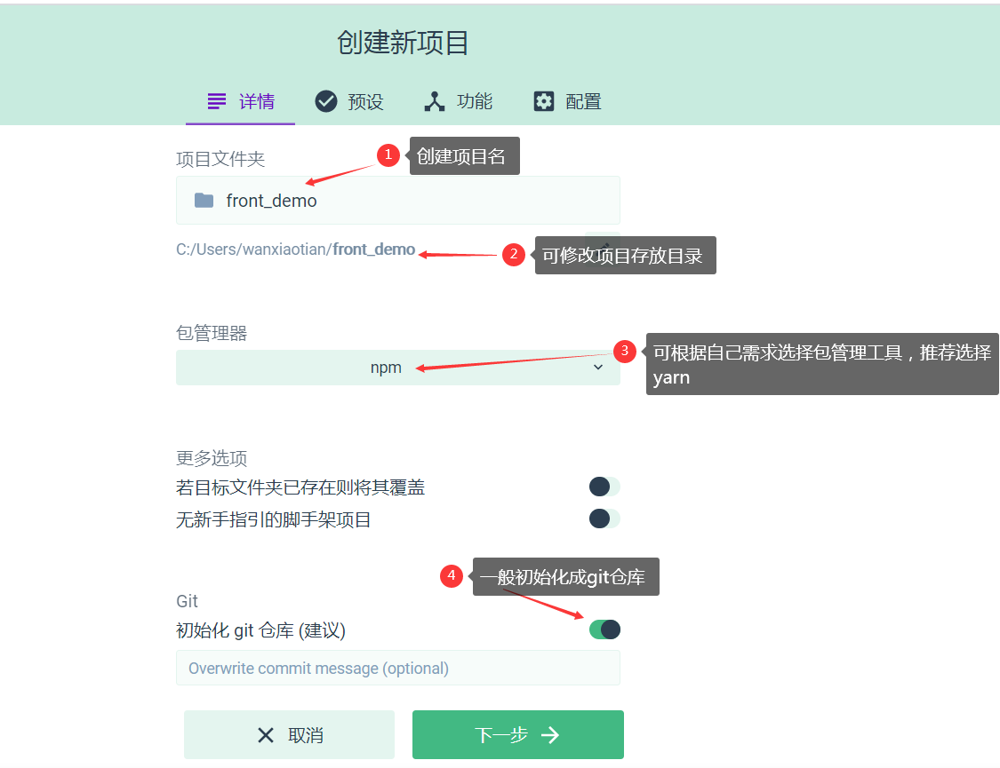
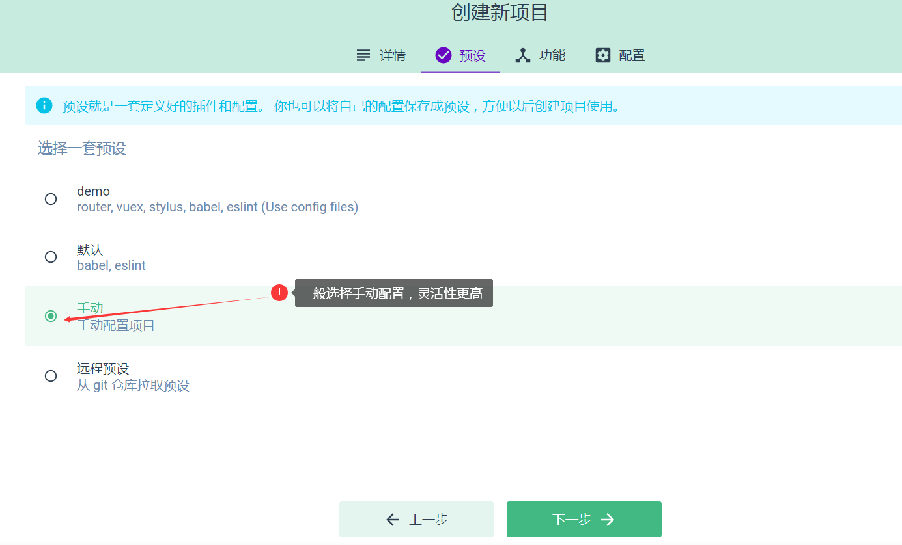
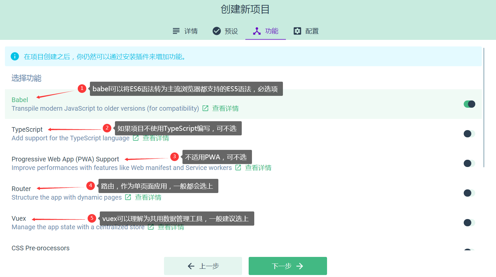
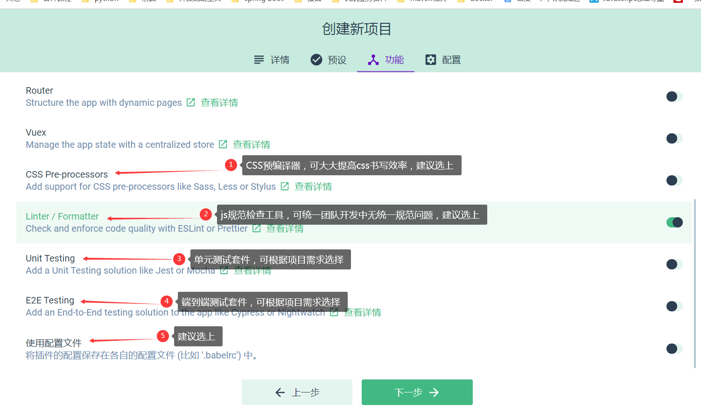
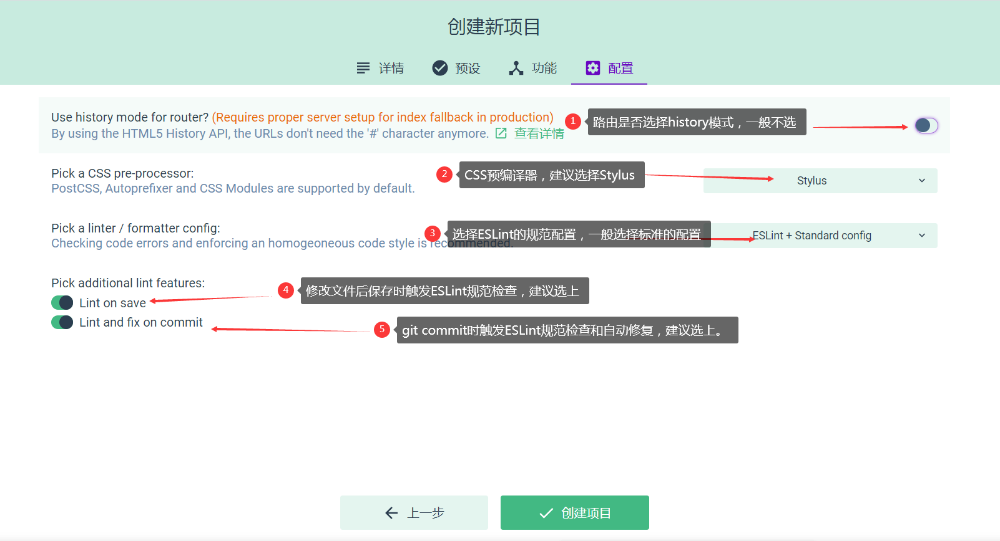
4. 最后创建项目

### 调整目录
调整src下的目录结构，以下目录结构为推荐目录结构，不同的项目可进行灵活地调整
将默认创建的`assert`目录删掉，创建`api`、`base`、`common/js`、`common/stylus`、`common/imgs`目录，如下：
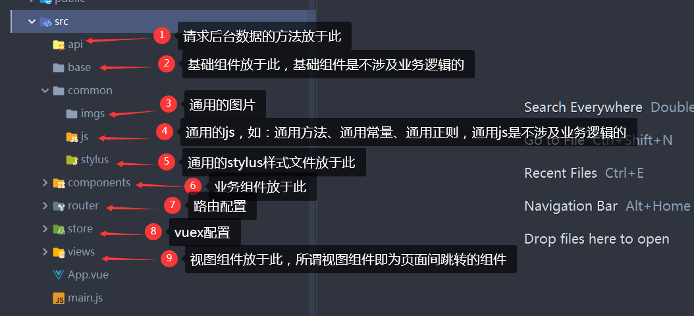

### 安装依赖
在项目开发中有一些重要的依赖需要提前安装。
1. [axios](http://www.axios-js.com/zh-cn/docs/): 官方推荐的http请求库，安装`npm install axios`
2. [element-ui](https://element.eleme.cn/#/zh-CN/component/installation): 饿了么开源的UI库，提供丰富的基础组件选择，**可根据项目需求选择**，安装`npm install element-ui`

### 自定义axios
在项目中使用[axios](http://www.axios-js.com/zh-cn/docs/)一般会做一些自定义的配置，比如：通用的请求头，请求拦截器和响应拦截器等。
```javascript
// api/network.js
import axios from 'axios'
import { Message, Loading } from 'element-ui'

const instance = axios.create({
  baseUrl: '/ATS/',
  headers: {
    'Content-Type': 'application/x-www-form-urlencoded;charset=UTF-8'
  }
})

let loadingLock = null
let loadingCount = 0
instance.interceptors.request.use((config) => {
  if (!navigator.onLine) {
    // todo 提示语需要国际化
    Message.error({
      message: '您的电脑无法联网，请检查网络连接!'
    })
  } else {
    openLoading()
    return config
  }
}, (error) => {
  return Promise.reject(error)
})

instance.interceptors.response.use((res) => {
  closeLoading()
  return res
}, (error) => {
  closeLoading()
  Message.error(error)
  return Promise.reject(error)
})

function openLoading() {
  ++loadingCount
  if(loadingCount < 2) {
    loadingLock = Loading.service({
      lock: true,
      text: 'Loading',
      spinner: 'my-el-custom-spinner',
      background: 'rgba(0, 0, 0, 0.7)'
    })
  }
}

function closeLoading() {
  --loadingCount
  if(loadingCount === 0) {
    loadingLock.close()
  }
}

export default instance
```

使用axios是，从network.js导入我们配置好的实例，比如：
```javascript
import apis from './urlConstants'
import netWork from './network'
import qs from 'qs'

export function login(userName, passWord) {
  // axios默认将对象转成json类型的数据进行传入，接口是需要表单型的数据，所以这里使用qs进行转换
  return netWork.post(apis.common.login, qs.stringify({
    userName: userName,
    passWord: passWord
  })).then((res) => {
    return Promise.resolve(res.data)
  }).catch((error) => {
    return Promise.reject(error)
  })
}
```

### 其他配置
如果有使用以下工具可参考此配置。
#### EditorConfig
editorconfig需要借助于ide的支持，它是为了统一多人协作开发文件的编码格式而生的。配置项目根目录下.editorconfig文件并且ide只支持.editorconfig的，ide就会根据.editorconfig中的配置来格式化代码。一般配置如下（vuecli构建好项目后会生成.editorconfig，一般无需自己配置）：
```
[*.{js,jsx,ts,tsx,vue}]
indent_style = space
indent_size = 2
trim_trailing_whitespace = true
insert_final_newline = true
```

#### ESlint
项目生成后，根目录下会有`.eslintrc.js`文件，该文件是对ESLint进行配置的，可根据自己项目的规范进行调整。可配置的规则见[官网](https://eslint.bootcss.com/docs/rules/)。

#### Stylus
Stylus语法请阅读[官网文档](https://stylus.bootcss.com/)。

#### Babel
Babel的配置文件是根目录下`babel.config.js`，一般无需配置。

### 运行示例
删除`views/Home.vue`，`router/index.js`修改为：
```javascript
import Vue from 'vue'
import VueRouter from 'vue-router'

Vue.use(VueRouter)

const routes = [
  {
    path: '/about',
    name: 'About',
    // route level code-splitting
    // this generates a separate chunk (about.[hash].js) for this route
    // which is lazy-loaded when the route is visited.
    component: () => import(/* webpackChunkName: "about" */ '../views/About.vue')
  }
]

const router = new VueRouter({
  routes
})

export default router
```

启动`npm run serve`
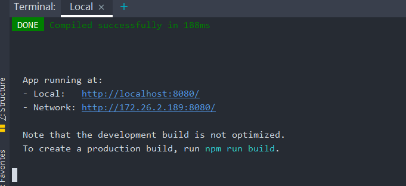
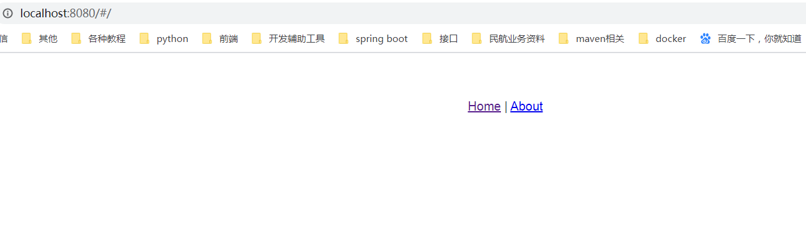

## 规范约定
[前端开发规范](norm.md)
