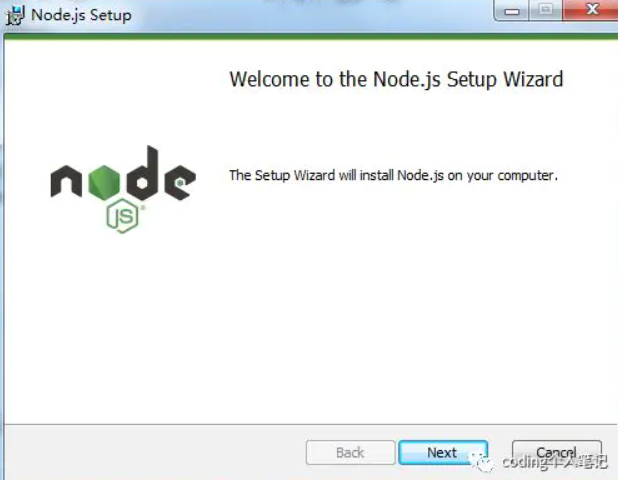
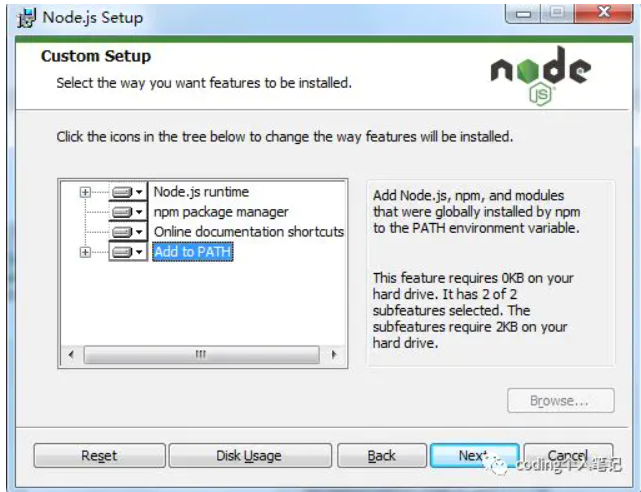
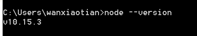

# 安装node
根据项目组要求安装对应的版本https://nodejs.org/dist/

1. 下载对应版本，以10.13.0为例https://nodejs.org/dist/v10.13.0/node-v10.13.0-x64.msi。
2. 下载完成后双击安装。

3. 一直点击next和accept，安装路径可自定义。
4. 最后点击这个Add to PATH，这样你就不用自己去配置环境变量。

5. 打开cmd，执行`node --version`看node是否安装成功

