# Vue前端开发规范

## 文件编码规范
[统一文件编码](webstorm_intall.md#统一编码)

[配置.editconfig](README.md#其他配置)

## 组件规范
### 组件分类
组件分为`视图组件`、`业务型通用组件`、`基础通用组件`。对应的目录存放位置分别是`src/views`、`src/components`、`src/base`。
+ 视图组件：一般是在路由中切换的组件，一个视图组件由多个`业务型通用组件`和`基础通用组件`组成。
+ 业务型通用组件：被视图组件引用
+ 基础通用组件：不包含业务逻辑，拿到任何一个项目中都能使用

### 组件目录命名
+ 组件目录

不同类型的组件放在对应的组件目录下，比如页头组件放在`components/my-header/MyHeader.vue`中，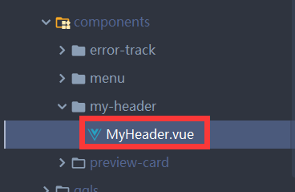，之所以为每个组件建一个单独的目录，是为了放该组件特有的js、图片等其他资源，如下图：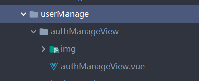。
组件目录也可以有更深层次的分类，比如在`views`视图组件中分不同的模块。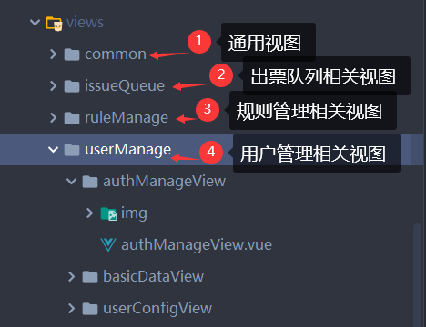

+ 组件命名

对于Java开发人员来说，我们可以把组件理解成类，所以组件名首字母应该大写，vue中引入组件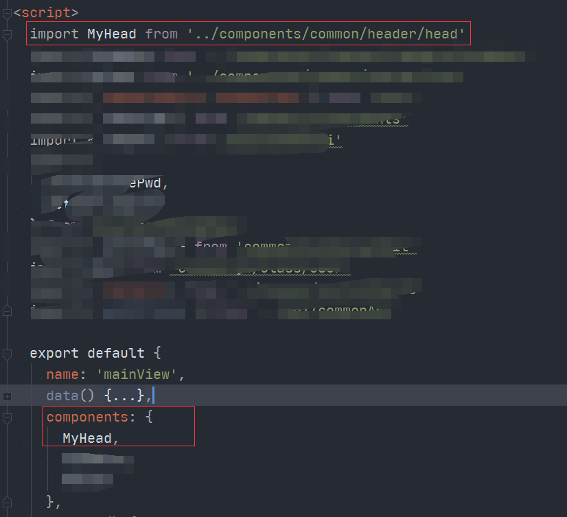，在页面中使用时使用kebab-case(短横线命名)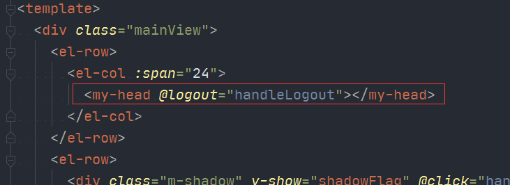

### 组件书写规范
+ 组件props规范
要声明类型、是否必填或默认值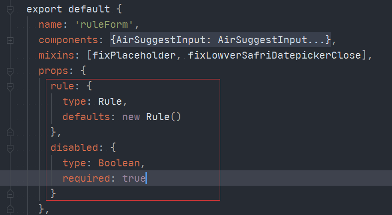

+ methods命名规范
1. 在scripts标签内调用的方法以下划线`_`起头，表示是scripts范围内私有的，方便一眼看出方法的适用范围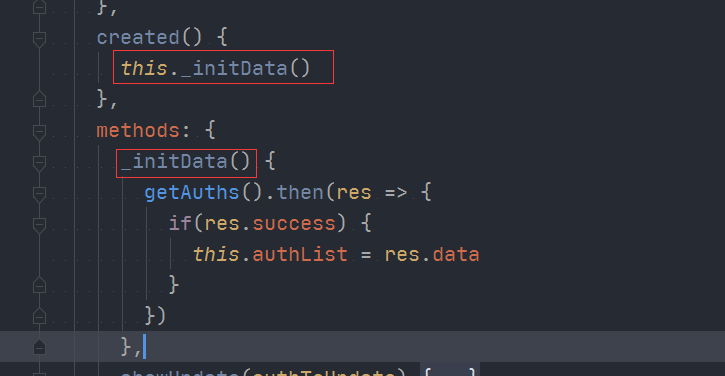
2. 事件绑定的方法以`handle`前缀命名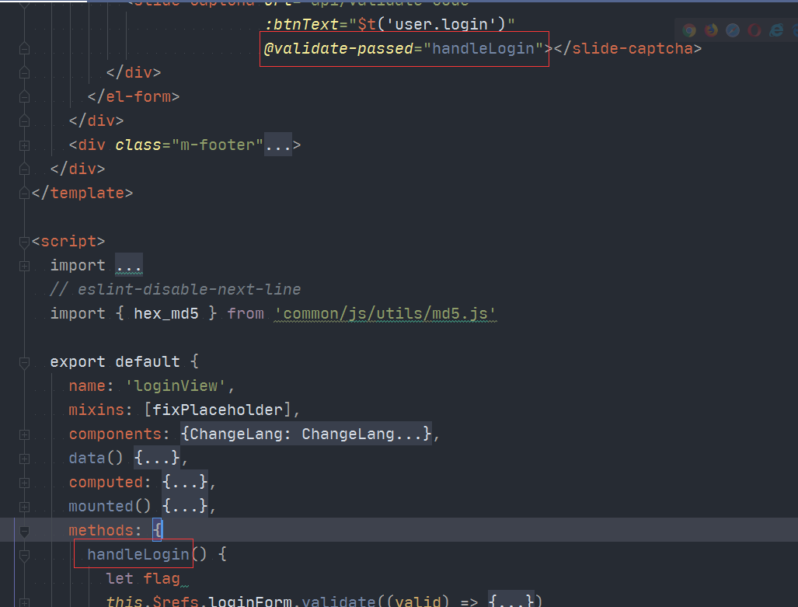

+ 自定义事件命名
以`on-`为前缀，如：`this.$emit('on-login')`

### vuex使用规范
将通用数据或有可能被通用的数据存入[vuex](https://vuex.vuejs.org/zh/)作为状态管理。一个简单的状态管理如下图：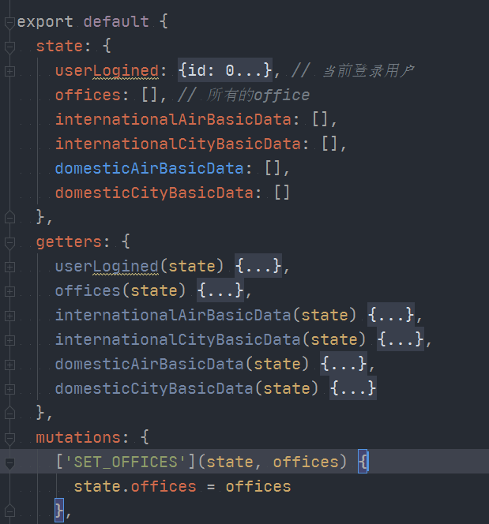
用mapGetters获取数据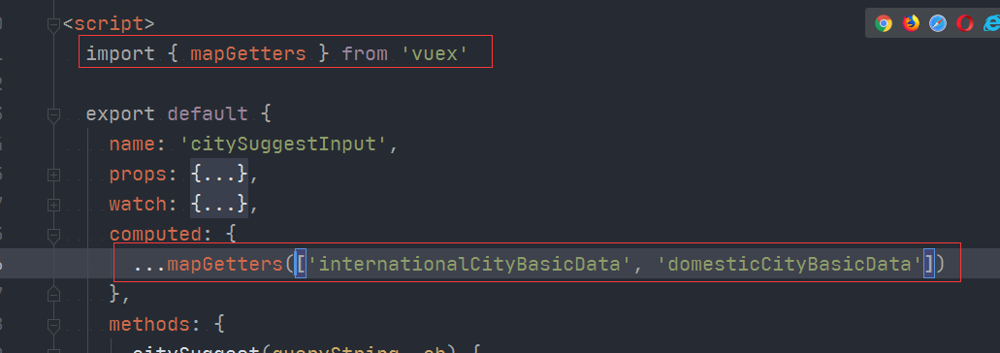
用mapMutations修改数据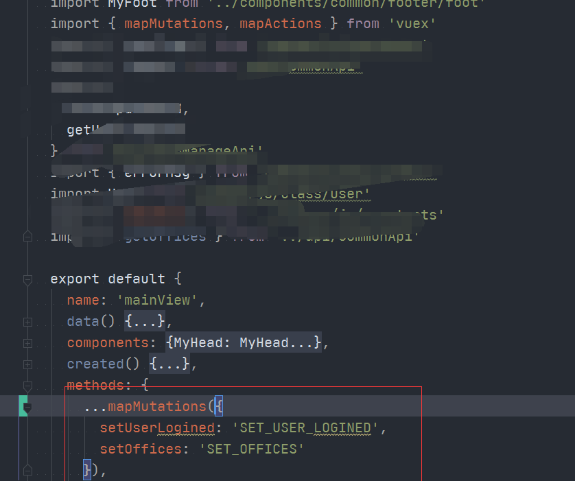
在`store/index.js`中引入日志插件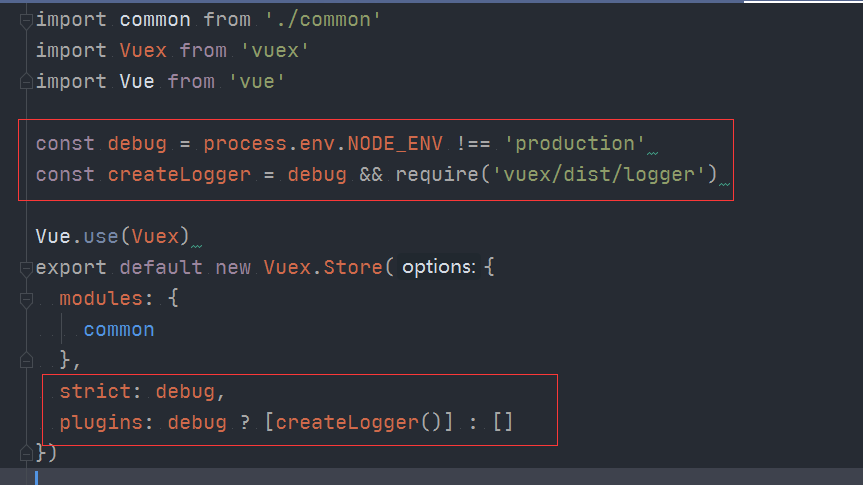
，引入日志插件后，我们只要严格按照mapGetters和mapMutations的方式去获取数据和修改数据，就能在浏览器的控制台看到vuex中数据被更改的记录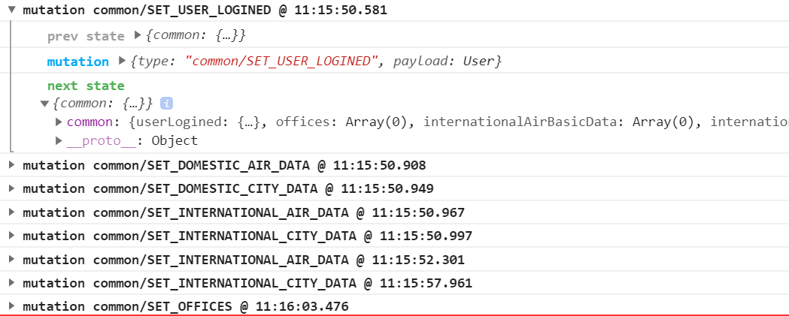
