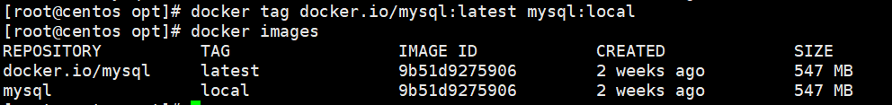

--- 
title: Docker核心之镜像
date: 2020-06-09
categories: 
 - 其它
tags: 
 - docker
---
::: tip 介绍
可以学习到Docker镜像的概念以及核心api
:::
<!-- more -->
## 获取镜像
> docker pull [image]

例：docker pull ubuntu 
```javascript
该命令实际上下载的是ubuntu:latest镜像，即最新的镜像
除此之外，还可以通过指定标签下载特定版本的一个镜像,如'docker pull ubuntu:14.04'
该方式是从默认的注册服务器中的ubuntu仓库中下载的镜像
```
```javascript
配置阿里镜像
vim /etc/docker/daemon.json
输入
{
	"registry-mirrors":["https://atofs07z.mirror.aliyuncs.com"]
}
重启docker服务
systemctl daemon-reload  
systemctl restart docker
```
## 查看镜像信息
> docker images

```javascript
REPOSITORY：镜像来源于哪个仓库
TAG:镜像的标签信息（版本），用于标记来自同一个仓库的不同镜像
IMAGE ID:镜像的ID号（唯一）
CREATED:创建时间
VIRTUAL SIZE:大小
```
## 添加标签（取别名）
> docker tag [localImage] [newImage]

例：docker tag docker.io/mysql:latest mysql:local


```javascript
docker tag命令为本地镜像添加新的标签，这两个镜像的ID是完全一致的。
它们实际上指向同一个镜像，只是别名不同而且
```

### 搜寻镜像
> docker search [image]

可以搜索远端仓库中共享的镜像，可用参数：

- --automated=false 仅显示自动创建的镜像
- --no-trunc=false 输出信息不截断显示
- [-s或--stars]=0 指定仅显示评价为指定星级以上的镜像 

### 删除镜像
> docker rmi [image]

其中image可以为标签或ID
```javascript
1、当image有多个标签时,如 docker rmi docker.io/mysql，只会删除该镜像多个标签中的指定标签而已。
2、当为镜像ID时，会先尝试删除所有指向该镜像的标签，然后删除该镜像文件本身
```

### 创建镜像
