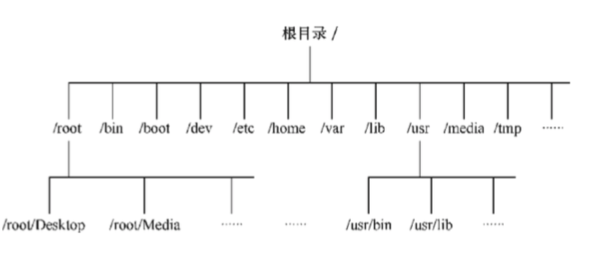

--- 
title: Linux基础
date: 2020-06-10
categories: 
 - 其它
tags: 
 - linux
---
::: tip 介绍
可以学习到Linux系统的基础知识以及常用的命令
:::
<!-- more -->
## Linux文件系统目录结构
Linux的文件系统目录结构是属于分层树形结构。因此，文件系统是由根目录（/）开始往下长，就像一棵倒长的树一样。如图所示：

安装Linux系统时，系统会建立一些默认的目录，每个目录都有其特殊功能。下面是Linux文件系统一些常用的目录：
- / (根目录)

    根目录位于分层文件系统的最顶层，它包含所有的目录和文件。

- /bin

    存放那些供系统管理员和普通用户使用的重要的linux命令的可执行文件。这个目录下的文件要么是可执行文件，要么是其它目录下的可执行文件的符号链接。一些常用的命令，如cat,cp,ls等都存放在这个目录中

- /boot

    存放用于启动Linux操作系统的所有文件，包括Linux内核的二进制映像。

- /dev

    dev是Device(设备)的缩写, 该目录下存放的是Linux的外部设备，在Linux中访问设备的方式和访问文件的方式是相同的。

- /etc

    这个目录用来存放所有的系统管理所需要的配置文件和子目录。

- /home

    存放一般用户的主目录

- /lib

    这个目录里存放着系统最基本的动态连接共享库，其作用类似于Windows里的DLL文件。几乎所有的应用程序都需要用到这些共享库。

- /mnt

    系统提供该目录是为了让用户临时挂载别的文件系统的，我们可以将光驱挂载在/mnt/上，然后进入该目录就可以查看光驱里的内容了。

- /opt

    这是给主机额外安装软件所摆放的目录。比如你安装一个ORACLE数据库则就可以放到这个目录下。默认是空的。

- /proc

    当前进程和系统的信息，该目录仅存在内存

- /root

    root用户（管理员用户）的主目录。其它用户的主目录都位于/home目录下。普通用户没有权限访问/root目录

- /sbin

    s就是Super User的意思，这里存放的是系统管理员使用的系统管理程序。

- /tmp

    这个目录是用来存放一些临时文件的。

- /usr

     这是一个非常重要的目录，用户的很多应用程序和文件都放在这个目录下，类似于windows下的program files目录。
 
 - /var
 
    这个目录中存放着在不断扩充着的东西，我们习惯将那些经常被修改的目录放在这个目录下。包括各种日志文件。

## 常用命令
### ls
> 用于显示目录内容，它的使用权限为所有用户

命令格式: `ls [参数] [文件名]`

|参数|含义|
|----|----|
|-a|列出所有文件|
|-l|以长格式显示指定目标的信息|
**注:** ll不是命令,是 ls -l的别名

### mkdir
> 建立子目录，它的使用权限是所有用户

命令格式：`mkdir [参数] [目录名]`

|参数|含义|
|----|----|
|-m|设定权限<模式>|
|-v|每次创建新目录都返回信息|

### rmdir
> 删除目录

命令格式：`rmdir 目录名`

### cd 
> 切换目录

命令格式：`cd 目录名`

### mv
> 用来为文件或目录改名，或者将文件由一个目录移入另一个目录中，它的使用权限是所有用户

命令格式：`mv 源文件名 目标文件名`
```javascript
-i: 若指定目录已有同名文件，则先询问是否覆盖旧文件;
-f: 在mv操作要覆盖某已有的目标文件时不给任何指示;
```

### cp
> 将文件或目录复制到其他目录中

命令格式：`cp [options] 源文件名 目标文件名`
```javascript
-a：此选项通常在复制目录时使用，它保留链接、文件属性，并复制目录下的所有内容。其作用等于dpR参数组合。
-d：复制时保留链接。这里所说的链接相当于Windows系统中的快捷方式。
-f：覆盖已经存在的目标文件而不给出提示。
-i：与-f选项相反，在覆盖目标文件之前给出提示，要求用户确认是否覆盖，回答"y"时目标文件将被覆盖。
-p：除复制文件的内容外，还把修改时间和访问权限也复制到新文件中。
-r：若给出的源文件是一个目录文件，此时将复制该目录下所有的子目录和文件。
-l：不复制文件，只是生成链接文件。
```

### rm 
> 删除文件或目录

命令格式：`rm [参数] 文件`

|参数|含义|
|----|----|
|-i|删除前逐一询问确认。|
|-r|指定将参数中列出的全部目录和子目录均递归删除|
|-f|忽视不存在的文件，不给予提示|

### grep
> 在指定文件中搜索特定的内容，并将含有这些内容的行标准输出

命令格式：`grep [-abcEFGhHilLnqrsvVwxy][-A<显示列数>][-B<显示列数>][-C<显示列数>][-d<进行动作>][-e<范本样式>][-f<范本文件>][--help][范本样式][文件或目录...]`

```
-a或--text 不要忽略二进制的数据。
-A<显示列数>或--after-context=<显示列数> 除了显示符合范本样式的那一列之外，并显示该列之后的内容。
-b或--byte-offset 在显示符合范本样式的那一列之前，标示出该列第一个字符的位编号。
-B<显示列数>或--before-context=<显示列数> 除了显示符合范本样式的那一列之外，并显示该列之前的内容。
-c或--count 计算符合范本样式的列数。
-C<显示列数>或--context=<显示列数>或-<显示列数> 除了显示符合范本样式的那一列之外，并显示该列之前后的内容。
-d<进行动作>或--directories=<进行动作> 当指定要查找的是目录而非文件时，必须使用这项参数，否则grep指令将回报信息并停止动作。
-e<范本样式>或--regexp=<范本样式> 指定字符串做为查找文件内容的范本样式。
-E或--extended-regexp 将范本样式为延伸的普通表示法来使用。
-f<范本文件>或--file=<范本文件> 指定范本文件，其内容含有一个或多个范本样式，让grep查找符合范本条件的文件内容，格式为每列一个范本样式。
-F或--fixed-regexp 将范本样式视为固定字符串的列表。
-G或--basic-regexp 将范本样式视为普通的表示法来使用。
-h或--no-filename 在显示符合范本样式的那一列之前，不标示该列所属的文件名称。
-H或--with-filename 在显示符合范本样式的那一列之前，表示该列所属的文件名称。
-i或--ignore-case 忽略字符大小写的差别。
-l或--file-with-matches 列出文件内容符合指定的范本样式的文件名称。
-L或--files-without-match 列出文件内容不符合指定的范本样式的文件名称。
-n或--line-number 在显示符合范本样式的那一列之前，标示出该列的列数编号。
-q或--quiet或--silent 不显示任何信息。
-r或--recursive 此参数的效果和指定"-d recurse"参数相同。
-s或--no-messages 不显示错误信息。
-v或--revert-match 反转查找。
-V或--version 显示版本信息。
-w或--word-regexp 只显示全字符合的列。
-x或--line-regexp 只显示全列符合的列。
-y 此参数的效果和指定"-i"参数相同。
--help 在线帮助。
```

### find
> 在目录中搜索文件

命令格式：`find [路径] [参数] [文件名]`

|参数|含义|
|----|----|
|-name|输出搜索结果，并且打印|
|-user|显示搜索文件的属性|

```javascript
将目前目录及其子目录下所有最近 20 天内更新过的文件列出
> find . -ctime -20
```

### tail
> 用来显示一个或多个文件的尾部（默认显示10行）

命令格式：`tail [参数] 文件名`

|参数|含义|
|----|----|
|+/-n|+n表示显示从文件第n行开始的所有行；-n表示显示文件的最后n行|
|-f|显示完文件的最后一行后，如果文件正在被追加，会继续显示追加的行，直到键入Ctrl + C|

### ssh
> 连接到远程服务器

例：ssh root@ip，后续输入密码
```javascript
参数 -p 指定端口(默认22)
查看是否安装 ssh rpm -qa|grep ssh
安装ssh远程服务 yun -y install ssh
```

### scp
> 将本机文件复制到远程服务器上

命令格式：`scp [参数] sourcefile targetfile`

例：scp abc/a.txt root@id:path
```javascript
参数 -p 指定端口(默认22)
```

### ps
> 用于显示当前进程 (process) 的状态

命令格式：ps [options] [--help]
```javascript
ps -ef 用标准的格式展示所有进程的状态
```
### kill
> 用于删除执行中的程序或工作

kill -9 [PID]
### yum
> Shell前端软件包管理工具

命令格式：`yum [options] [command] [package ...]`

- options: 可选，选项包括-h（帮助），-y（当安装过程提示选择全部为"yes"），-q（不显示安装的过程）等等。
- command: 要进行的操作
- package: 操作的对象。
```javascript
1.列出所有可更新的软件清单命令：yum check-update
2.更新所有软件命令：yum update
3.仅安装指定的软件命令：yum install <package_name>
4.仅更新指定的软件命令：yum update <package_name>
5.列出所有可安裝的软件清单命令：yum list
6.删除软件包命令：yum remove <package_name>
7.查找软件包 命令：yum search <keyword>
8.清除缓存命令:
yum clean packages: 清除缓存目录下的软件包
yum clean headers: 清除缓存目录下的 headers
yum clean oldheaders: 清除缓存目录下旧的 headers
yum clean, yum clean all (= yum clean packages; yum clean oldheaders) :清除缓存目录下的软件包及旧的headers
```
### lsof
> 查看端口
> lsof -i:端口
>
### 查看linux系统版本
> cat /proc/version

### vim中使用查找命令查找指定字符串
> /pattern Enter

*注：* n 继续朝同一方向搜索，N 反方向进行搜索

### cat 
> 该命令用于查看文本文件的内容。

语法格式：cat [-AbeEnstTuv] [--help] [--version] fileName
```javascript
-n 或 --number：由 1 开始对所有输出的行数编号。
-b 或 --number-nonblank：和 -n 相似，只不过对于空白行不编号。
-s 或 --squeeze-blank：当遇到有连续两行以上的空白行，就代换为一行的空白行。
-v 或 --show-nonprinting：使用 ^ 和 M- 符号，除了 LFD 和 TAB 之外。
-E 或 --show-ends : 在每行结束处显示 $。
-T 或 --show-tabs: 将 TAB 字符显示为 ^I。
-e : 等价于 -vE。
-A, --show-all：等价于 -vET。
-e：等价于"-vE"选项；
-t：等价于"-vT"选项；
```

### chmod 
> linux/Unix 的文件调用权限分为三级 : 文件拥有者、群组、其他。利用 chmod 可以藉以控制文件如何被他人所调用。

语法: chmod [-cfvR] [--help] [--version] mode file...
```javascript
mode : 权限设定字串，格式如下 :
[ugoa...][[+-=][rwxX]...][,...]
其中：
u 表示该文件的拥有者，g 表示与该文件的拥有者属于同一个群体(group)者，o 表示其他以外的人，a 表示这三者皆是。
+ 表示增加权限、- 表示取消权限、= 表示唯一设定权限。
r 表示可读取，w 表示可写入，x 表示可执行，X 表示只有当该文件是个子目录或者该文件已经被设定过为可执行。
其他参数说明：
-c : 若该文件权限确实已经更改，才显示其更改动作
-f : 若该文件权限无法被更改也不要显示错误讯息
-v : 显示权限变更的详细资料
-R : 对目前目录下的所有文件与子目录进行相同的权限变更(即以递回的方式逐个变更)
--help : 显示辅助说明
--version : 显示版本
```
此外chmod也可以用数字来表示权限如 :
```javascript
chmod 777 file
```
语法为： 
```javascript
chmod abc file

其中a,b,c各为一个数字，分别表示User、Group、及Other的权限。
r=4，w=2，x=1
若要rwx属性则4+2+1=7；
若要rw-属性则4+2=6；
若要r-x属性则4+1=5。
```
实例：
```javascript
1. 将文件 file1.txt 设为所有人皆可读取 : 
chmod ugo+r file1.txt 
2. 将文件 file1.txt 设为所有人皆可读取 :
chmod a+r file1.txt
3. 数字表示 
  chmod a=rwx file
   和
   chmod 777 file
   效果相同
   chmod ug=rwx,o=x file
   和
   chmod 771 file
```
### Linux下查看文件和文件夹大小
```javascript
df可以查看一级文件夹大小、使用比例、档案系统及其挂入点，但对文件却无能为力。
du可以查看文件及文件夹的大小。
```

### tar 
> tar是用来建立，还原备份文件的工具程序，它可以加入，解开备份文件内的文件。

语法格式： tar [options]  文件或目录 [-C <目的目录>]
```javascript
-c或--create 建立新的备份文件。
-x或--extract或--get 从备份文件中还原文件。
-f<备份文件>或--file=<备份文件> 指定备份文件。
-v或--verbose 显示指令执行过程。
-z或--gzip或--ungzip 通过gzip指令处理备份文件。
-t或--list 列出备份文件的内容。
```

实例：
```javascript
1. 将当前目录下的文件夹testtar压缩为test.tar.gz
    tar -czvf test.tar.gz testtar/
2. 将当前文件夹下的test.tar.gz解压到/test目录下
    tar -xzvf  test.tar.gz -C /test
3. 列出压缩文件test.tar.gz内容
     tar -tzvf test.tar.gz
```

### zip
> zip是个使用广泛的压缩程序，文件经它压缩后会另外产生具有”.zip”扩展名的压缩文件。

语法格式：zip [options] 压缩文件 文件
```javascript
-r 递归处理，将指定目录下的所有文件和子目录一并处理。
```

实例：  zip -r testzip.zip testzip/

### unzip
> unzip为.zip压缩文件的解压缩程序。

语法格式：unzip [options] 压缩文件
```javascript
-l 显示压缩文件内所包含的文件。
-v 执行时显示详细的信息。
```

实例： unzip -v testzip.zip 
